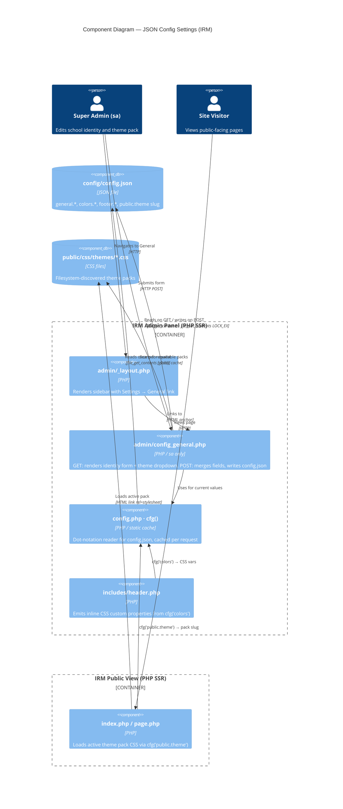

# C4 Component Diagram — JSON Config Settings

Shows how `config/config.json` flows through the system after the `json-config-settings` change: from the new admin editor through the cfg() helper to both the admin shell and the public view.

## Key flows

| Flow | Path |
|---|---|
| Admin edits school identity | SA → `config_general.php` POST → `config.json` (LOCK_EX + backup) |
| Admin selects theme pack | SA → `config_general.php` POST → `config.json → public.theme` (slug from glob scan) |
| Public view reads identity | `pub_view` → `cfg()` → `config.json → general.*` |
| Public view loads theme CSS | `pub_view` → `cfg('public.theme')` → `public/css/themes/{slug}.css` |
| Admin chrome reads branding | `_layout.php` → `cfg('general.title')`, `cfg('general.logoUrl')` |
| CSS custom properties | `header.php` → `cfg('colors')` → inline `<style>:root{…}` |
