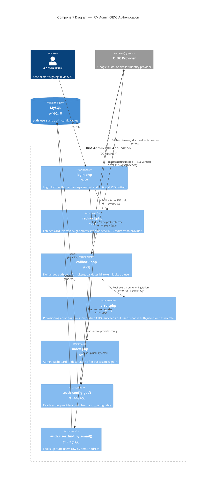

# C4 Component Diagram — OIDC Authentication

Shows the PHP components involved in the OIDC sign-in flow and their relationships.

## Notes

- **Provisioning failure** = OIDC token is valid but the email is not in `auth_users`, or the user row has no `role`. Redirects to `error.php`.
- **Protocol error** = state mismatch, expired id_token, nonce failure, token endpoint unreachable. Redirects back to `login.php` via flash message.
- `redirect.php` uses dynamic PKCE — only attaches `code_challenge` when the provider's discovery document advertises `S256` in `code_challenge_methods_supported`.
