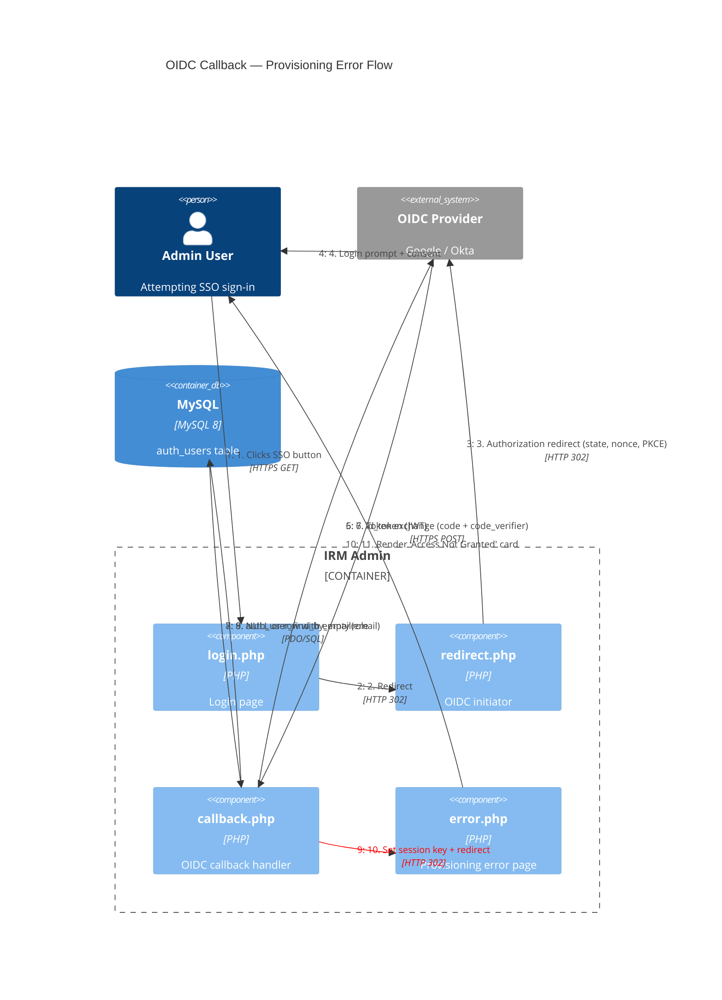

# C4 Dynamic Diagram — OIDC Callback: Provisioning Error Path

Shows the numbered request flow when a user successfully authenticates with the OIDC provider but cannot be provisioned into IRM (email not registered, or no role assigned).

## Flow Decision Points

| Step | Outcome | Path |
|------|---------|------|
| Step 5 | `$_GET['error']` present | → `login.php` via `oidc_fail()` (flash error) |
| Step 5 | State mismatch | → `login.php` via `oidc_fail()` |
| Step 7 | Token expired / nonce mismatch | → `login.php` via `oidc_fail()` |
| Step 9 | User not found (`NULL`) | → `error.php` via `oidc_provision_fail()` |
| Step 9 | User found, `role` empty | → `error.php` via `oidc_provision_fail()` |
| Step 9 | User found, `is_active = 0` | → `login.php` via `oidc_fail()` |
| Step 9 | User found, role set, active | → `index.php` (success) |
