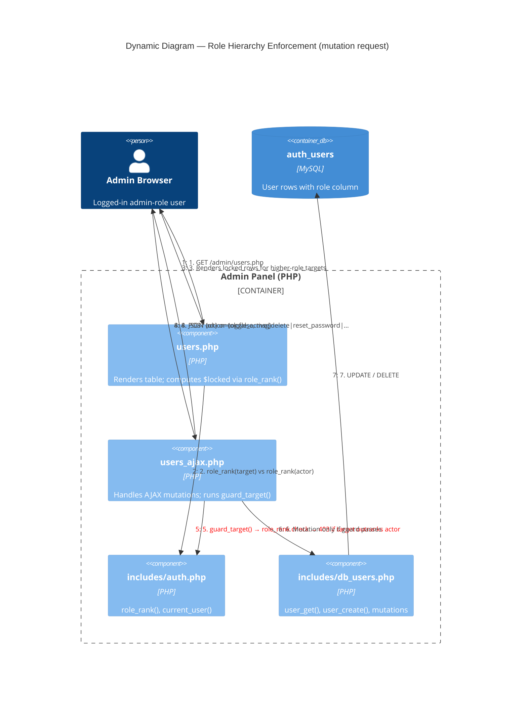

# Role Hierarchy Enforcement — Dynamic Flow

Shows how a mutation request (e.g. toggle active, delete, reset password) is
validated against role hierarchy after the `fix-role-edit-protection` change.

## Notes

- Steps 2–3 are UI-only (render time); step 5 is the authoritative server guard.
- `role_rank()` lives in `includes/auth.php` — see ADR-0013.
- The `add_user` path has its own hierarchy check in `users_ajax.php` (not shown
  above, as it has no `guard_target` call — it validates the *new* role against
  the actor's rank before inserting).
