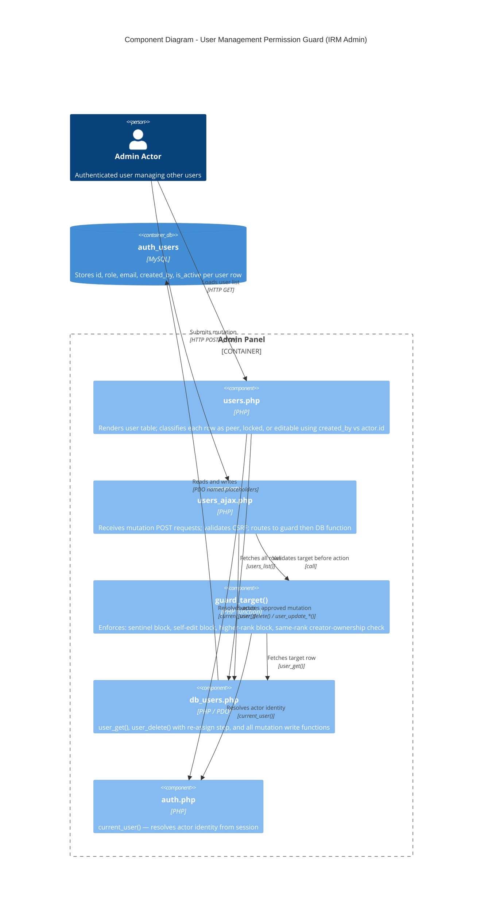

## Context

User management mutations currently flow through `guard_target()` in `users_ajax.php`, which enforces sentinel, self-edit, higher-rank, and same-rank checks. The same-rank check used a `bool $block_same_rank` parameter with a hardcoded `sa`-role exemption — `sa` actors could mutate any peer, all other roles could not. This exemption was duplicated in the UI row renderer (`users.php`). The `created_by` column has been reliably set on every `auth_users` insert since the column was introduced. No schema changes are needed.

See ADR-0016 for the decision rationale.

## Goals / Non-Goals

**Goals:**
- Replace the `sa`-role exemption with a uniform creator-ownership check at both the server guard and UI render layers
- Ensure `user_delete()` re-assigns `created_by` of the deleted user's creations to the deleter before removing the row
- Remove all `$me['role'] !== 'sa'` peer-exemption branches from guard and renderer

**Non-Goals:**
- No schema migrations — `created_by` is already in place
- No changes to cross-rank access (higher-rank actors retain full access to lower-rank targets)
- No changes to the sentinel bypass, self-edit block, or higher-rank block
- No UI changes beyond row classification logic

## Decisions

### 1. `guard_target()` — remove `block_same_rank`, add creator check

**Current:**
```php
function guard_target(int $id, bool $block_same_rank = true): array {
    ...
    if ($block_same_rank && $me && $me['role'] !== 'sa'
        && role_rank($target['role']) === role_rank($me['role'])) {
        ajax_err('Permission denied.', 403);
    }
}
```

**New:**
```php
function guard_target(int $id, bool $allow_same_rank_active = false): array {
    ...
    if (!$allow_same_rank_active
        && role_rank($target['role']) === role_rank($me['role'])
        && (int)($target['created_by'] ?? 0) !== (int)$me['id']) {
        ajax_err('Permission denied.', 403);
    }
}
```

`toggle_active` continues to pass `allow_same_rank_active: true` (same call-site pattern as before). The `$target` array already contains `created_by` because `user_get()` selects `u.*`. No extra query needed.

### 2. `users.php` — update `$is_peer` condition

**Current:**
```php
$is_peer = !$is_sa && !$is_me && !$is_higher
           && $user['role'] !== 'sa'
           && (role_rank($u['role']) === role_rank($user['role']));
```

**New:**
```php
$is_peer = !$is_sa && !$is_me && !$is_higher
           && (role_rank($u['role']) === role_rank($user['role']))
           && (int)$u['created_by'] !== (int)$user['id'];
```

The `users_list()` query already returns `created_by` via `u.*`. No query changes needed.

### 3. `user_delete()` — re-assign before DELETE

```php
function user_delete(int $id): void {
    $by = audit_by();
    // Re-assign creations to the deleter before removing the row
    $st = db()->prepare(
        'UPDATE auth_users SET created_by = :by WHERE created_by = :id'
    );
    $st->execute([':by' => $by, ':id' => $id]);

    $st = db()->prepare('DELETE FROM auth_users WHERE id = :id');
    $st->execute([':id' => $id]);
}
```

The FK constraint is `ON DELETE SET NULL`. Running the UPDATE first moves all `created_by = id` references to the deleter before the DELETE fires, so the constraint never triggers. No explicit transaction is needed — if the UPDATE succeeds and the DELETE fails, the worst outcome is that orphan rows have the deleter's ID (still owned, still manageable).

## Architecture



## Risks / Trade-offs

- **Breaking for existing multi-SA installs** → Non-sentinel `sa` actors who managed peers they did not create will lose that access. The sentinel (`email='admin'`) is the admin-of-last-resort for cross-ownership operations. Document in release notes.
- **Re-assign is not atomic** → The UPDATE + DELETE are two separate statements. A crash between them leaves orphaned rows with the deleter's `created_by`, which is still a valid owned state. Acceptable given the single-user, self-hosted deployment model.

## Migration Plan

1. Deploy updated `admin/users.php`, `admin/users_ajax.php`, `includes/db_users.php`
2. No DB migration required
3. Rollback: revert those three files to prior version

## Open Questions

None — all resolved during grill session (sentinel check, NULL `created_by` handling, SA exemption removal, re-assign strategy).
