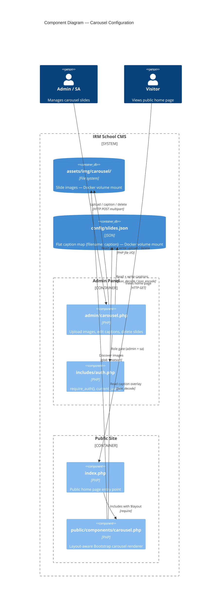

# Design: carousel-config

## Context

The carousel is currently file-system-only — images are dropped into `assets/img/carousel/` and auto-discovered by `glob()`. Captions live in `config/slides.json` as an array of `{image_path, caption}` objects (currently empty). There is no admin UI to upload images or set captions, and no public carousel component exists yet (the spec is defined but not implemented as a reusable include).

This change adds:
- An admin management page (`admin/carousel.php`) for uploading, captioning, and deleting slides.
- A flat-object rewrite of `config/slides.json` (ADR-0018).
- A layout-aware public component (`public/components/carousel.php`) included by `index.php`.

## Goals / Non-Goals

**Goals:**
- Admin and sa users can manage carousel slides entirely through the admin UI.
- Images dropped directly into `assets/img/carousel/` (e.g. at deploy time) still appear automatically.
- The public carousel component is layout-aware for future home-page builder placement.
- Docker deployments are documented with the correct volume mounts (ADR-0019).

**Non-Goals:**
- Slide ordering UI (order is determined by `natsort()` on filenames; rename the file to reorder).
- Per-slide enable/disable toggle.
- CSS asset consolidation (`public/css/themes/` → `assets/css/themes/`) — separate `asset-consolidation` change.
- Gallery or any other upload type.

## Architecture

## Decisions

### 1. slides.json becomes a flat `{filename: caption}` object (ADR-0018)

**Chosen over**: keeping the existing array-of-objects schema or moving captions to DB.

The admin UI makes filename the natural key — `$captions[basename($image)]` is O(1) vs iterating an array. The current `slides.json` is `[]` so the migration is trivial (`[]` → `{}`). JSON-only slides (entries without a physical file) are dropped — the admin upload UI replaces that use case.

### 2. Both sources coexist: glob + slides.json overlay

**Chosen over**: admin-only managed list (removing auto-discovery).

Images dropped into `assets/img/carousel/` at deploy time (Docker mount) must appear without admin action. Removing auto-discovery would break the zero-friction deploy model. The overlap is harmless: glob finds the file, slides.json optionally provides a caption.

### 3. Public component accepts `$layout` variable

**Chosen over**: wrapping the component at the call site.

The home-page builder will include components by filename with a pre-set `$layout` variable. If the wrapper is the component's responsibility, the builder's include call is uniform — just `$layout = 'col-left'; require 'public/components/carousel.php';`. No extra wrapper file per layout variant needed.

`$layout` values: `'full'` (default, `col-12`), `'col-left'` (`col-md-6`), `'col-right'` (`col-md-6`).

### 4. Settings accordion opens to `admin` + `sa`; General stays `sa`-only

**Chosen over**: separate Content accordion for carousel.

Follows the Authorization accordion pattern (accordion visible to a role group; sub-items have individual gates). Carousel is content management, but it lives under Settings because it drives a visual element of the public site — consistent with General (site identity) being there too. This avoids adding a new top-level accordion for a single item.

### 5. File upload saved directly under original (sanitised) filename

**Chosen over**: UUID/hash-based filenames.

The filename IS the key in slides.json and the sort key for natsort ordering. Preserving a meaningful filename lets deployers control slide order by renaming (`01_welcome.jpg`, `02_campus.jpg`). Sanitisation strips spaces and special characters; conflicts are handled by overwrite (last upload wins for the same name).

## Risks / Trade-offs

| Risk | Mitigation |
|---|---|
| Concurrent admin writes corrupt `slides.json` | Acceptable for school CMS (rare simultaneous sessions); file locking can be added later |
| Filename collision on upload overwrites an existing slide | UI should warn if filename already exists; overwrite is intentional behaviour |
| Docker operator forgets to mount `/assets/img/carousel/` | Document prominently; uploaded images are lost on rebuild without the mount |
| Large carousel folder slows glob on every public page load | Acceptable for school scale; APCu cache can wrap the glob call if needed |

## Migration Plan

1. Update `config/slides.json` from `[]` to `{}` — one-line change, no data loss (was empty).
2. Update any existing reader of `slides.json` in `index.php` to use the flat object format.
3. Settings accordion role gate in `admin/_layout.php` updated from `sa`-only to `admin`+`sa`.
4. Docker deployment documentation: add volume mounts for `/config` and `/assets/img/carousel/`.

No DB schema changes. No rollback complexity — `slides.json` is trivially reversible.

## Open Questions

- None. All decisions resolved during the grill-with-docs session.
